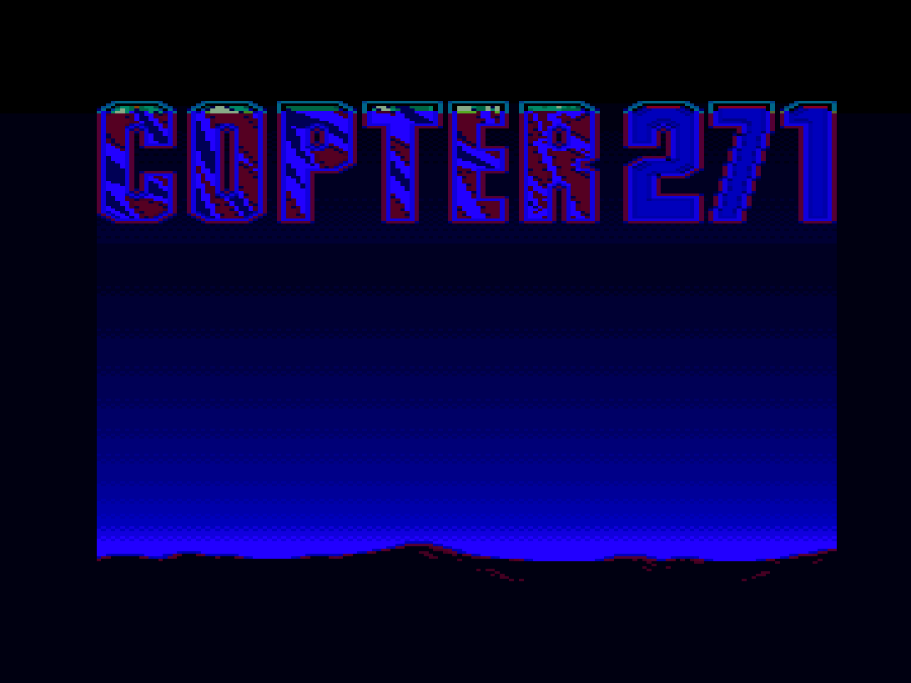
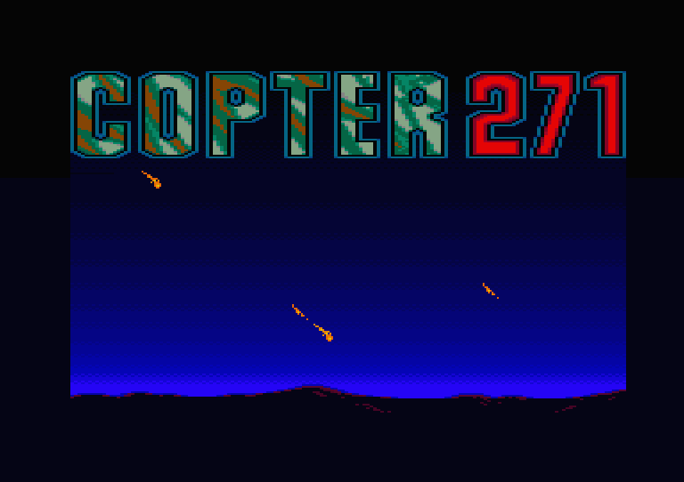
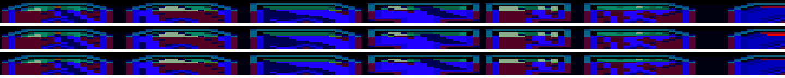
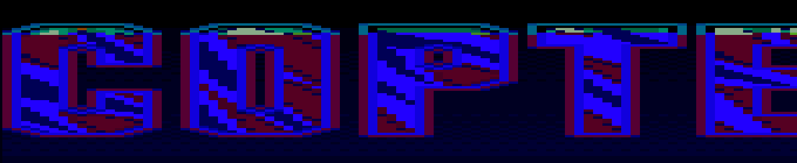

# Defect: Copter 271 Title Screen Top Rows Palette Glitch

- **Stream**: plus
- **Case ID**: `copter271_6128plus_title`
- **Status**: title defects fixed on hardware; gameplay vertical-scroll glitches open (see section 4)
- **Target Platform**: Amstrad Plus 6128+ / GX4000
- **Media**: `Copter 271.cpr` (`local/test_media/cartridges/01_PlusGames/Copter 271.cpr`)

---

## 1. Symptom & Description
When running Copter 271 CPR on a 6128+ without user input, the Loriciel intro plays first. From capture 4 onwards, the title logo is reached. On FPGA core builds `5c16b17` and `d35412a`, the top rows of the title logo exhibit wrong colours compared to real hardware and the reference emulator (Amspirit).

## 2. Visual Evidence
- **Real Device Comparison**:
  
- **Reference Emulator (Amspirit)**:
  
- **Seam Comparison (Rows 38-51)**:
  
- **Title Top Rows Zoom**:
  

## 3. Reproduction & Automated Test
The test configuration is codified in [`copter271-6128plus.json`](./copter271-6128plus.json) for execution with the hardware loop driver. Full-resolution screenshots and snapshot (`snapshot_20260913_120524.sna`) are archived in `local/test_media/defects/copter271/`.

## 4. Resolution
- **Title logo top rows**: fixed on device with `c595031` / `b5c3014`. PRI no longer fires on
  line 256+n.
- **Title palette flash**: fixed and hardware-confirmed on build `88262b9` (2026-09-14). DCSR
  bit 7 reported raster on a DMA acknowledge, dropping raster interrupts; the latch-on-deassertion
  in `rtl/plus/asic_ga_timing.v` (`raster_fire_pending`) is pinned by vector `pr07` in
  `sim/plus/asic_pri_test.cpp`. Backlog item B19 holds the full record.
- **Open**: vertical-scrolling glitches during gameplay, not yet investigated and possibly
  older than these fixes.
